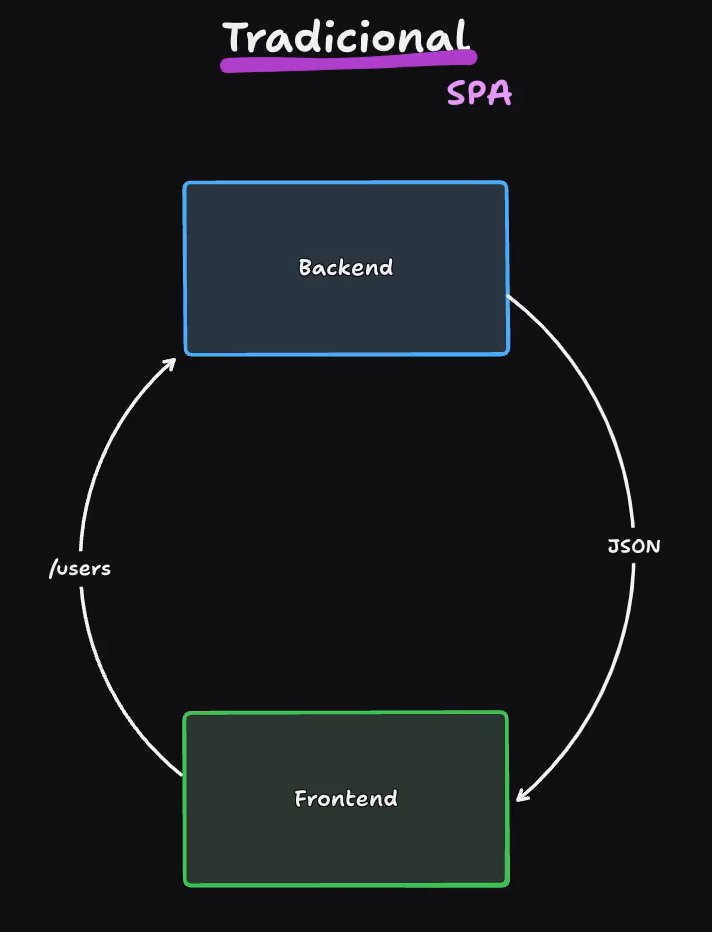

# � Meu Caderno de Estudos

> Repositório para organizar e consultar meus estudos de forma rápida.

---

## � Índice (Menu)

- [O que é o Next.js](#o-que-e-o-nextjs)

---

## O que é o Next.js

SPA => Frontend bate no backend por exemplo /users e retorna um json. 

Lá pra 2016 tinhamos problemas de indexação por exemplo o google tentava acessar o react criado tradicionalmente com SPA que tinha um arquivo index com arquivo root onde o react é injetado que é´o ponto inicial da aplicação react.

O arquivo index é um arquivo em branco até o reatc ser carregado pelo javascript esse periodo este tempo era um problema porque quando o google acessava nossa página ele acessava uma página em branco porque não tinha carregado ainda.

Vamos dizer que era um robozinho que acessava a nossa página para poder indexar e alguns deles entravam com javascript desabilitado e o segundo ponto era o timeout são problemas de SEO.

SSR => Quando o nosso frontend bater neste API /users quem vai chamar esta API é o Next.js, o Next.js vai bater no backend, o backend vai processar os dados e retornar json, listagem. 

Next.js é um intermediário que é um servidor escrito em node, e node é um runtime que executa javascript fora do browser.

Nextjs renderiza dentro do servidor node e devolve para front o html 

