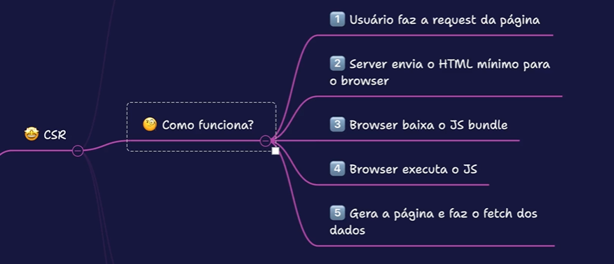
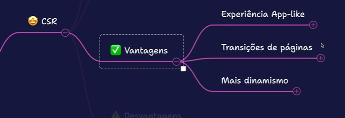
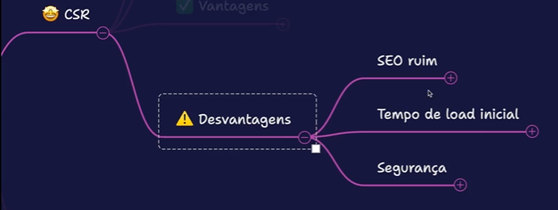
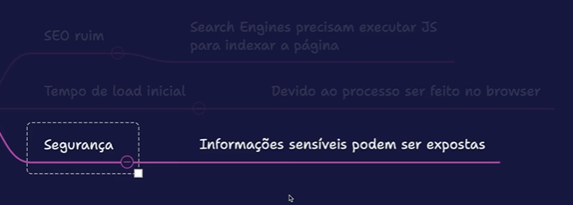
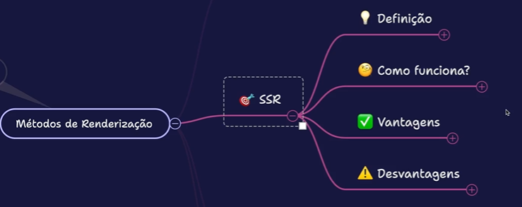
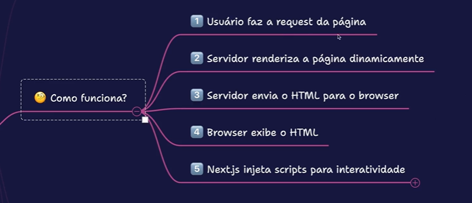
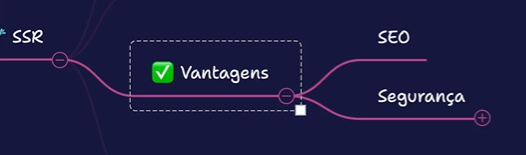
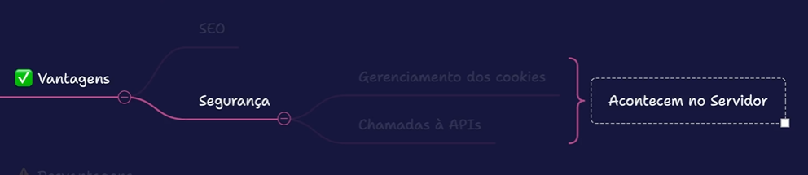
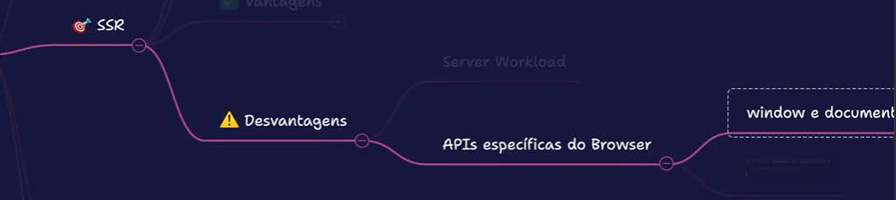
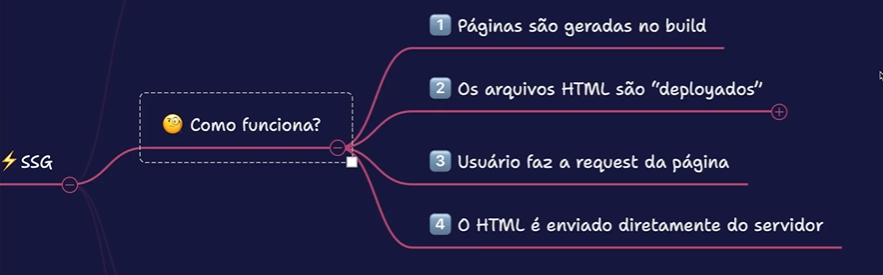

# � Meu Caderno de Estudos

> Repositório para organizar e consultar meus estudos de forma rápida.

---

## � Índice (Menu)

- [Métodos de renderização](#metodos-de-renderizacao)
  - [CSR ](#csr)
    - [vantagens ](#vantagens)
    - [desvantagens ](#desvantagens)
  - [SSR ](#ssr)
  - [SSG ](#ssg)

---

## Métodos de renderização

### CSR => Client Server Renderi

#### Vantagens

#### Desvantagens 

### SSR => Server Side Renderi

#### Vantagens

#### Desvantagens 

### SSG => Static Site Generation

